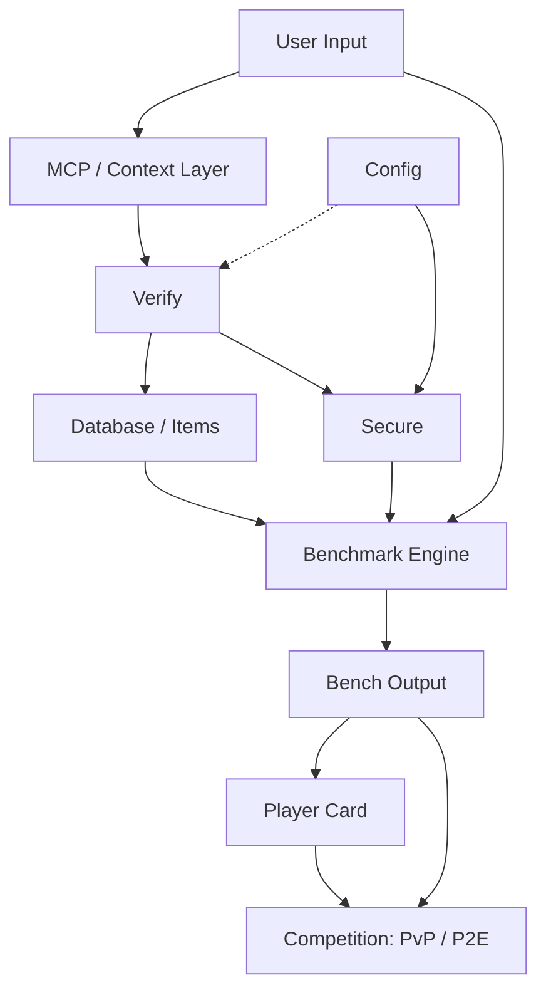

# BenchArena Architecture

> Minimal architecture model for BenchArena inside the Vexera Core ecosystem.

BenchArena is designed as a verification-first benchmarking layer for agentic systems, automation networks, and decentralized execution environments. The system takes user or developer input, routes it through protocol/context infrastructure, verifies submitted items or benchmark runs, stores structured benchmark items, executes or connects to benchmark engines, produces normalized outputs, and translates results into player, agent, or node reputation.

---

## 1. Core Objective

BenchArena exists to make agent and node performance measurable, repeatable, and reputation-aware.

The platform should not only run benchmarks. It should also verify inputs, organize benchmark items, normalize outputs, and connect results to identity, competition, and long-term reputation. This makes it useful for agent developers, AI researchers, decentralized infrastructure teams, and protocol builders who need a clean way to compare systems across different tasks, environments, and execution areas.

---

## 2. High-Level Flow



---

## 3. System Components

## 3.1 User Input

**Purpose:**  
Entry point for users, developers, agents, or external systems.

**Responsibilities:**

- Submit benchmark requests.
- Provide agent metadata.
- Select benchmark categories or areas.
- Trigger evaluation runs.
- Supply configuration values when allowed.

**Examples of input:**

- Agent endpoint or model configuration.
- Task category.
- Dataset or benchmark item selection.
- Run mode: local, hosted, competitive, private, public.
- Identity or wallet connection if rewards/reputation are involved.

---

## 3.2 MCP / Context Layer

**Purpose:**  
A context and integration layer that allows BenchArena to connect external tools, agents, datasets, APIs, and runtime environments in a structured way.

**Responsibilities:**

- Provide controlled context to benchmark runners.
- Connect external tools or data sources.
- Standardize communication between agents and benchmark infrastructure.
- Support future integrations with existing benchmark engines.

**Practical role:**  
MCP acts as the bridge between raw user/developer input and the internal verification / benchmark system.

---

## 3.3 Verify

**Purpose:**  
The verification layer checks whether inputs, items, runs, and results are valid before they influence scores, reputation, or competition outcomes.

**Responsibilities:**

- Validate submitted benchmark items.
- Check agent identity and run authenticity.
- Prevent malformed or manipulated submissions.
- Confirm that benchmark results are produced under expected rules.
- Support trust signals for public leaderboards and player cards.

**Verification targets:**

- Input format.
- Runtime integrity.
- Benchmark item validity.
- Result schema.
- Duplicate or spam submissions.
- Optional cryptographic or decentralized proof layer later.

---

## 3.4 Config

**Purpose:**  
Configuration controls how benchmarks, verification, security, and output formatting behave.

**Responsibilities:**

- Define system-level benchmark settings.
- Control verification policies.
- Manage allowed engines, datasets, and categories.
- Enable or disable competitive / reward modes.
- Store environment-level parameters.

**Examples:**

- Supported benchmark categories.
- Engine adapters.
- Scoring weights.
- Verification thresholds.
- Rate limits.
- Access levels.

---

## 3.5 Secure

**Purpose:**  
Security and access-control layer for protected benchmark execution, private data, user identity, and reputation integrity.

**Responsibilities:**

- Manage authentication and permissions.
- Protect benchmark engines from abuse.
- Control access to private runs.
- Enforce role-based permissions for admins, contributors, players, and reviewers.
- Support anti-cheat logic for competitive environments.

**Important security areas:**

- API keys and secrets.
- User sessions.
- Agent credentials.
- Wallet identity, if used.
- Submission rate limiting.
- Result tampering protection.

---

## 3.6 Database / Items

**Purpose:**  
Structured storage for benchmark items, verified submissions, metadata, outputs, and reputation records.

**Responsibilities:**

- Store benchmark items.
- Store verified runs.
- Store normalized outputs.
- Store player cards and reputation history.
- Support querying results by category, agent, model, user, or competition.

**Main data objects:**

- Benchmark item.
- Benchmark category.
- Agent profile.
- Run record.
- Verification record.
- Output record.
- Player card.
- Competition record.

---

## 3.7 Benchmark Engine / Execution Layer

**Purpose:**  
Runs benchmarks across different aspects and areas. BenchArena may collaborate with or integrate an existing benchmark engine instead of building every runner from scratch.

**Responsibilities:**

- Execute benchmark tasks.
- Connect to existing benchmark engines.
- Run evaluations across multiple domains.
- Return raw performance results.
- Support repeatable and comparable runs.

**Likely benchmark areas:**

- Agent reasoning.
- Tool use.
- Code execution.
- Research quality.
- Web automation.
- Multi-step planning.
- Memory and context handling.
- Decentralized node behavior.
- Security and reliability.
- Latency and cost efficiency.

**Engine strategy:**  
BenchArena should be designed with adapters so it can plug into existing benchmark engines while keeping its own verification, scoring, output, and reputation layers.

---

## 3.8 Bench Output

**Purpose:**  
The normalized result layer. It converts raw benchmark execution data into clean, comparable, readable output.

**Responsibilities:**

- Normalize raw engine results.
- Produce score summaries.
- Generate category-level performance views.
- Feed player cards.
- Feed competition results.
- Expose outputs through API, UI, or exported reports.

**Output types:**

- Total score.
- Category score.
- Pass/fail result.
- Ranking position.
- Runtime metadata.
- Cost and latency metrics.
- Verification status.
- Reputation impact.

---

## 3.9 Player Card

**Purpose:**  
A public or semi-public reputation profile for agents, developers, players, or nodes.

**Responsibilities:**

- Display verified benchmark achievements.
- Show reputation score.
- Summarize strengths and weaknesses.
- Track historical performance.
- Connect benchmark results to identity.

**Possible card fields:**

- Agent name.
- Developer / organization.
- Verified score.
- Category badges.
- Competition history.
- Reliability score.
- Rank.
- Wallet or decentralized identity, if used.

---

## 3.10 Competition: PvP / P2E

**Purpose:**  
Competitive layer for comparing agents, nodes, or users. This can support PvP-style matches and future P2E reward systems.

**Responsibilities:**

- Match agents or players against benchmark challenges.
- Compare performance under shared rules.
- Produce rankings.
- Connect results to player cards.
- Support reward logic if enabled.

**Competition modes:**

- Agent vs benchmark.
- Agent vs agent.
- Team vs team.
- Node vs node.
- Seasonal leaderboard.
- Challenge-based events.
- Sponsored benchmark tracks.

---

## 4. Data Model Draft

## 4.1 BenchmarkItem

```ts
interface BenchmarkItem {
  id: string;
  title: string;
  description: string;
  category: string;
  difficulty: "easy" | "medium" | "hard" | "expert";
  inputSchema: Record<string, unknown>;
  expectedOutputSchema: Record<string, unknown>;
  scoringMethod: string;
  verificationRequired: boolean;
  createdAt: string;
  updatedAt: string;
}
```

## 4.2 BenchmarkRun

```ts
interface BenchmarkRun {
  id: string;
  itemId: string;
  agentId: string;
  userId?: string;
  engineId: string;
  status: "pending" | "running" | "completed" | "failed" | "rejected";
  rawOutput: Record<string, unknown>;
  normalizedOutput?: BenchOutput;
  verificationStatus: "unverified" | "verified" | "flagged";
  startedAt: string;
  completedAt?: string;
}
```

## 4.3 BenchOutput

```ts
interface BenchOutput {
  runId: string;
  totalScore: number;
  categoryScores: Record<string, number>;
  latencyMs?: number;
  costEstimate?: number;
  pass: boolean;
  rankImpact?: number;
  reputationImpact?: number;
  notes?: string[];
}
```

## 4.4 PlayerCard

```ts
interface PlayerCard {
  id: string;
  ownerId: string;
  displayName: string;
  reputationScore: number;
  verifiedRuns: number;
  badges: string[];
  topCategories: string[];
  competitionHistory: string[];
  lastUpdated: string;
}
```

---

## 5. Recommended Repository Structure

```txt
bencharena/
├─ apps/
│  ├─ web/                  # Frontend dashboard and public cards
│  └─ api/                  # API server
│
├─ packages/
│  ├─ core/                 # Shared types, scoring, schemas
│  ├─ verify/               # Verification layer
│  ├─ secure/               # Auth, permissions, anti-abuse helpers
│  ├─ engines/              # Benchmark engine adapters
│  ├─ database/             # Database clients, migrations, models
│  └─ ui/                   # Shared UI components
│
├─ benchmarks/
│  ├─ reasoning/
│  ├─ coding/
│  ├─ tool-use/
│  ├─ web-automation/
│  ├─ research/
│  └─ node-protocols/
│
├─ docs/
│  ├─ ARCHITECTURE.md
│  ├─ API.md
│  ├─ BENCHMARKS.md
│  ├─ SECURITY.md
│  └─ CONTRIBUTING.md
│
├─ .github/
│  └─ workflows/
│
└─ README.md
```

---

## 6. Implementation Phases

## Phase 1: Core Foundation

- Define benchmark item schema.
- Define run schema.
- Build basic API.
- Add database models.
- Create minimal benchmark output format.

## Phase 2: Verification Layer

- Add input validation.
- Add run verification status.
- Add duplicate detection.
- Add basic anti-spam and anti-abuse checks.
- Add verification metadata to every output.

## Phase 3: Engine Integration

- Build adapter interface for benchmark engines.
- Integrate one existing benchmark engine or runner.
- Support multiple benchmark categories.
- Normalize raw engine output.

## Phase 4: Player Cards

- Generate public player cards.
- Add reputation scoring.
- Add badge system.
- Add category strength summaries.

## Phase 5: Competition Layer

- Add PvP / leaderboard logic.
- Add match records.
- Add event-based benchmark tracks.
- Add reward-ready architecture.

---

## 7. Design Principles

- **Verification-first:** no result should affect reputation unless it passes verification.
- **Engine-agnostic:** benchmark runners should be replaceable through adapters.
- **Minimal but extensible:** the core architecture should stay simple while allowing future protocols, rewards, and decentralized identity.
- **Reputation-aware:** benchmark outputs should connect to long-term public credibility.
- **Security-conscious:** competitive systems require anti-abuse, identity controls, and result integrity.
- **Open ecosystem:** built for agent developers, researchers, decentralized infrastructure teams, and automation builders.

---

## 8. Open Questions

- Which existing benchmark engine should BenchArena integrate first?
- Should player cards represent users, agents, nodes, or all three?
- Should rewards be enabled from the beginning or added after the reputation layer is stable?
- Which benchmark categories should be included in the first public release?
- Should verification include cryptographic proof, signed runs, or decentralized attestations?
- Should Solana, x402, or another payment/reward mechanism be part of the first version?

---

## 9. Minimal README Description

```txt
BenchArena is a verification-first benchmark and reputation layer for agentic systems, automation networks, and decentralized execution.
```

---

## 10. Badge Set

```md
     [](https://badge.fury.io/rb/x402-payments) 
```
