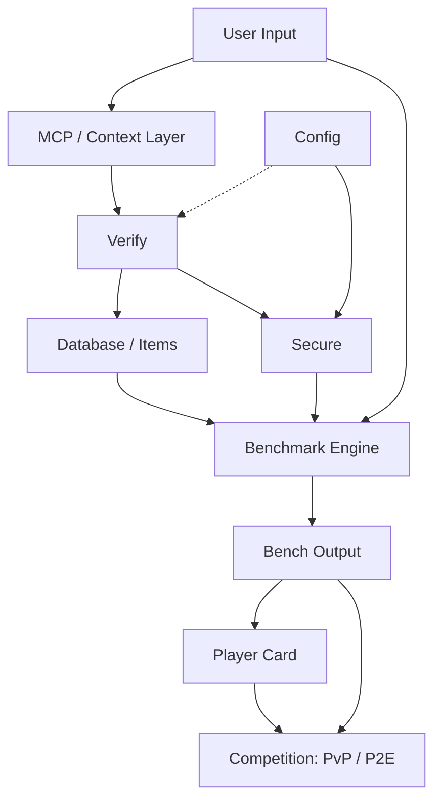

# BenchArena Architecture

> Minimal architecture model for BenchArena inside the Vexera Core ecosystem.

BenchArena is designed as a verification-first benchmarking layer for agentic systems, automation networks, and decentralized execution environments. The system takes user or developer input, routes it through protocol/context infrastructure, verifies submitted items or benchmark runs, stores structured benchmark items, executes or connects to benchmark engines, produces normalized outputs, and translates results into player, agent, or node reputation.

---

## 1. Core Objective

**BenchArena exists to make agent and node performance measurable, repeatable, and reputation-aware.**

The platform should not only run benchmarks. It should also verify inputs, organize benchmark items, normalize outputs, and connect results to identity, competition, and long-term reputation. This makes it useful for agent developers, AI researchers, decentralized infrastructure teams, and protocol builders who need a clean way to compare systems across different tasks, environments, and execution areas.

---

## 2. High-Level Flow



---

## 3. System Components

BenchArena is built as a modular benchmark and reputation stack. Each layer has a clear role: receive inputs, verify runs, execute benchmarks, normalize results, and turn performance into public reputation.

---

### 3.1 User Input

Entry point for developers, agents, players, and external systems.

**Handles:**

- Agent or model configuration
- Benchmark category selection
- Run mode: local, hosted, private, public, or competitive
- Optional identity, wallet, or reputation connection

---

### 3.2 MCP / Context Layer

Integration layer for connecting agents, tools, APIs, datasets, and runtime environments.

**Role:**

- Pass structured context into benchmark runs
- Standardize communication between agents and external systems
- Support future integrations with existing benchmark engines

---

### 3.3 Verify

Trust layer that checks whether submissions, runs, and results are valid before they affect scores or reputation.

**Checks:**

- Input format
- Agent identity
- Runtime integrity
- Result schema
- Duplicate or manipulated submissions
- Optional proof or decentralized verification later

---

### 3.4 Config

System control layer for benchmark behavior, scoring rules, verification policies, and access settings.

**Controls:**

- Supported benchmark categories
- Engine adapters
- Scoring weights
- Verification thresholds
- Rate limits
- Public, private, and competitive modes

---

### 3.5 Secure

Security and access-control layer for protected benchmark execution.

**Protects:**

- API keys and secrets
- User sessions
- Agent credentials
- Private benchmark runs
- Submission limits
- Anti-cheat and result tampering logic

---

### 3.6 Database / Items

Core storage layer for benchmark items, runs, outputs, player cards, and reputation history.

**Stores:**

- Benchmark items
- Agent profiles
- Run records
- Verification records
- Output records
- Player cards
- Competition records

---

### 3.7 Benchmark Engine / Execution Layer

Execution layer responsible for running benchmarks across different domains. BenchArena can integrate with existing benchmark engines instead of rebuilding every runner from scratch.

**Benchmark areas:**

- Agent reasoning
- Tool use
- Code execution
- Research quality
- Web automation
- Planning
- Memory and context handling
- Node behavior
- Security, reliability, latency, and cost

**Strategy:**  
Use adapter-based integrations so BenchArena can plug into external engines while keeping its own verification, scoring, output, and reputation layers.

---

### 3.8 Bench Output

Normalized results layer that turns raw benchmark data into clean, comparable output.

**Produces:**

- Total score
- Category scores
- Pass/fail results
- Ranking position
- Runtime metadata
- Cost and latency metrics
- Verification status
- Reputation impact

---

### 3.9 Player Card

Reputation profile for agents, developers, players, or nodes.

**Shows:**

- Agent name
- Developer or organization
- Verified scores
- Category badges
- Competition history
- Reliability score
- Rank
- Optional wallet or decentralized identity

---

### 3.10 Competition: PvP / P2E

Competitive layer for comparing agents, nodes, teams, or players under shared benchmark rules.

**Modes:**

- Agent vs benchmark
- Agent vs agent
- Team vs team
- Node vs node
- Seasonal leaderboards
- Challenge events
- Sponsored benchmark tracks
- Optional reward logic

## 4. Data Model Draft

## 4.1 BenchmarkItem

```ts
interface BenchmarkItem {
  id: string;
  title: string;
  description: string;
  category: string;
  difficulty: "easy" | "medium" | "hard" | "expert";
  inputSchema: Record<string, unknown>;
  expectedOutputSchema: Record<string, unknown>;
  scoringMethod: string;
  verificationRequired: boolean;
  createdAt: string;
  updatedAt: string;
}
```

## 4.2 BenchmarkRun

```ts
interface BenchmarkRun {
  id: string;
  itemId: string;
  agentId: string;
  userId?: string;
  engineId: string;
  status: "pending" | "running" | "completed" | "failed" | "rejected";
  rawOutput: Record<string, unknown>;
  normalizedOutput?: BenchOutput;
  verificationStatus: "unverified" | "verified" | "flagged";
  startedAt: string;
  completedAt?: string;
}
```

## 4.3 BenchOutput

```ts
interface BenchOutput {
  runId: string;
  totalScore: number;
  categoryScores: Record<string, number>;
  latencyMs?: number;
  costEstimate?: number;
  pass: boolean;
  rankImpact?: number;
  reputationImpact?: number;
  notes?: string[];
}
```

## 4.4 PlayerCard

```ts
interface PlayerCard {
  id: string;
  ownerId: string;
  displayName: string;
  reputationScore: number;
  verifiedRuns: number;
  badges: string[];
  topCategories: string[];
  competitionHistory: string[];
  lastUpdated: string;
}
```

---

## 5. Recommended Repository Structure

```txt
bencharena/
├─ apps/
│  ├─ web/                  # Frontend dashboard and public cards
│  └─ api/                  # API server
│
├─ packages/
│  ├─ core/                 # Shared types, scoring, schemas
│  ├─ verify/               # Verification layer
│  ├─ secure/               # Auth, permissions, anti-abuse helpers
│  ├─ engines/              # Benchmark engine adapters
│  ├─ database/             # Database clients, migrations, models
│  └─ ui/                   # Shared UI components
│
├─ benchmarks/
│  ├─ reasoning/
│  ├─ coding/
│  ├─ tool-use/
│  ├─ web-automation/
│  ├─ research/
│  └─ node-protocols/
│
├─ docs/
│  ├─ ARCHITECTURE.md
│  ├─ API.md
│  ├─ BENCHMARKS.md
│  ├─ SECURITY.md
│  └─ CONTRIBUTING.md
│
├─ .github/
│  └─ workflows/
│
└─ README.md
```

---

## 6. Implementation Phases

## Phase 1: Core Foundation

- Define benchmark item schema.
- Define run schema.
- Build basic API.
- Add database models.
- Create minimal benchmark output format.

## Phase 2: Verification Layer

- Add input validation.
- Add run verification status.
- Add duplicate detection.
- Add basic anti-spam and anti-abuse checks.
- Add verification metadata to every output.

## Phase 3: Engine Integration

- Build adapter interface for benchmark engines.
- Integrate one existing benchmark engine or runner.
- Support multiple benchmark categories.
- Normalize raw engine output.

## Phase 4: Player Cards

- Generate public player cards.
- Add reputation scoring.
- Add badge system.
- Add category strength summaries.

## Phase 5: Competition Layer

- Add PvP / leaderboard logic.
- Add match records.
- Add event-based benchmark tracks.
- Add reward-ready architecture.

---

## 7. Design Principles

- **Verification-first:** no result should affect reputation unless it passes verification.
- **Engine-agnostic:** benchmark runners should be replaceable through adapters.
- **Minimal but extensible:** the core architecture should stay simple while allowing future protocols, rewards, and decentralized identity.
- **Reputation-aware:** benchmark outputs should connect to long-term public credibility.
- **Security-conscious:** competitive systems require anti-abuse, identity controls, and result integrity.
- **Open ecosystem:** built for agent developers, researchers, decentralized infrastructure teams, and automation builders.

---

## 8. Open Questions

- Which existing benchmark engine should BenchArena integrate first?
- Should player cards represent users, agents, nodes, or all three?
- Should rewards be enabled from the beginning or added after the reputation layer is stable?
- Which benchmark categories should be included in the first public release?
- Should verification include cryptographic proof, signed runs, or decentralized attestations?
- Should Solana, x402, or another payment/reward mechanism be part of the first version?

---

## 9. Minimal README Description

```txt
BenchArena is a verification-first benchmark and reputation layer for agentic systems, automation networks, and decentralized execution.
```

---

## 10. Badge Set

```md
     [](https://badge.fury.io/rb/x402-payments) 
```
