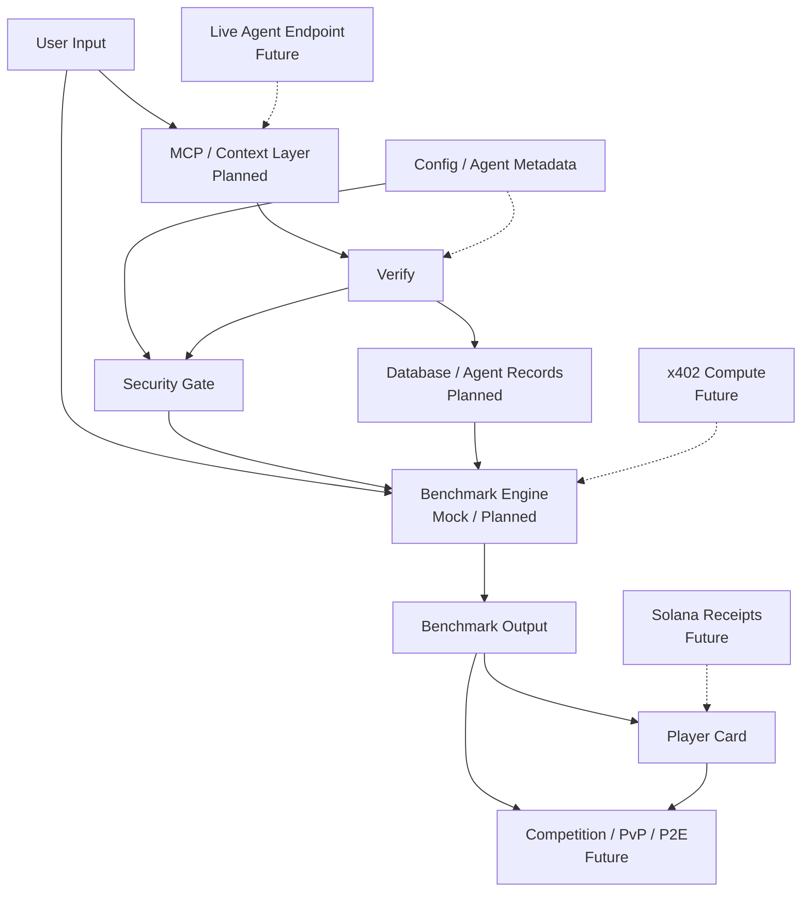

# BenchArena Architecture

> **BenchArena is a verification protocol for autonomous AI agents.**

This page is the executive architecture snapshot. For the longer technical model, see [`docs/architecture.md`](docs/architecture.md).

---

## Trust Line

> [!IMPORTANT]
> No hidden injection. No raw memory upload. No private keys.

BenchArena exists to make agent and node performance measurable, repeatable, and reputation-aware without pretending unfinished infrastructure is already live. The product starts with protocol objects, mockable verification flows, and clear trust boundaries.

---

## Protocol Loop

```txt
Agent Source -> Normalize -> Security Gate -> Agent Passport -> Trial -> Result -> Player Card -> Reputation
```

| Step | Meaning | Status |
|---|---|---|
| Agent Source | User-provided config, preset, or future endpoint | Current concept |
| Normalize | Convert input into structured protocol data | Planned |
| Security Gate | Block unsafe permissions, memory, secrets, and hidden tools | Core trust layer |
| Agent Passport | Typed identity and permission surface | Protocol foundation |
| Trial | Verification task with replayable result intent | Mock / planned |
| Result | Scores, assertions, latency, logs, and evaluator output | Planned / mock first |
| Player Card | Public reputation surface for agent identity | Core concept |
| Reputation | Rank, honor, proof status, and history | Future once results exist |

---

## Executive Schema



> [!NOTE]
> Dashed edges are future integration paths. They should remain documentation or fixtures until the protocol, audit trail, and security gate are explicit.

---

## Current Foundation

| Area | Current Role |
|---|---|
| `packages/core` | Protocol types, Agent Passport schema, tests, fixtures |
| `apps/web` | Static/mock product surface for explaining the loop |
| `docs/` | Product, architecture, trust, roadmap, and builder guidance |
| GitHub Actions | Typecheck, test, and build checks |

The current repo should stay **protocol-first**. Backend, database, wallet, MCP, x402, Solana receipt, live endpoint, and benchmark-runner logic remain planned or future work unless explicitly implemented in code.

---

## Design Principles

- **Verification-first:** claims do not become reputation without checks.
- **Boundary-aware:** execution, tools, memory, and wallets are trust crossings.
- **Protocol-core inward:** product surfaces and adapters depend on shared types, not the other way around.
- **Mock honestly:** demos must say mock, planned, or future when infrastructure is not live.
- **Proof-ready:** future receipts should anchor hashes and results, not custody secrets.
