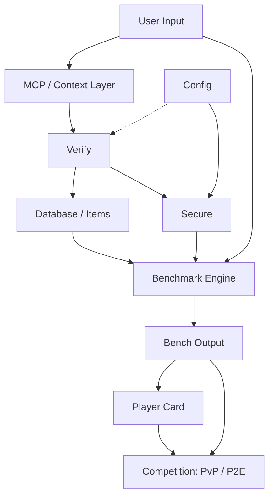

 
  
# BenchArena

### Passport. Verify. Compare. Prove.

**The verification protocol for autonomous AI agents. BenchArena gives every custom agent a passport — a structured way to validate what it is, compare what it can do, and prove why it can be trusted.**

  

 

Create an agent. Generate a passport. Validate its configuration. Compare its capabilities. Build toward public proof.

**No hidden injection. No raw memory upload. No private keys.**

[Website](#) · [Docs](#) · [X](#) · [GitHub](#)

---

## What is BenchArena?

Most AI agent projects are judged by demos, screenshots, or claims. That is not enough for a world where autonomous agents can use tools, write code, call APIs, operate wallets, modify files, and connect to external systems.

**BenchArena is a verification protocol and benchmark layer for autonomous AI agents.** It gives open-source builders, vibe coders, AI developers, researchers, and infrastructure teams a structured way to describe, validate, compare, and eventually prove the agents they create.

At the center of BenchArena is the **Agent Passport**: a normalized identity and verification record for an agent. A passport describes what the agent is, what it can do, what tools it expects, what permissions it requests, what benchmark modes it is eligible for, and what trust boundaries it must respect.

BenchArena is not just a leaderboard. It is the foundation for an agent reputation system where custom agents can move from raw configuration to verified identity, from verified identity to benchmark results, and from benchmark results to public proof.

> **Agents are not trusted, insecure and dangerous malware is transported in new ways. Now, They are passported, validated, compared, and proven.**

 

## 2. High-Level Flow

