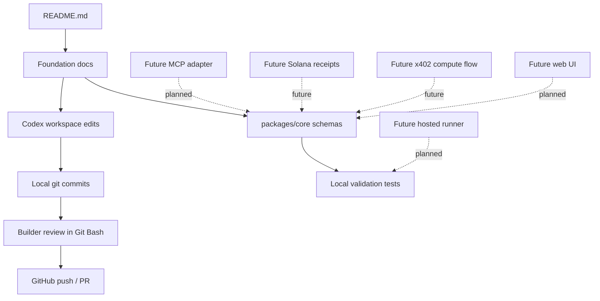

<div align="center">

# BenchArena

### Passport. Verify. Compare. Prove.

**A verification protocol for autonomous AI agents. BenchArena turns an agent from a claim into a passported, inspectable system with declared tools, permissions, benchmark eligibility, and proof-ready results.**

[](https://opensource.org/licenses/MIT)
[](https://www.typescriptlang.org/)
[](https://nodejs.org/)
[](https://pnpm.io/)
[](https://github.com/vexera-core/bencharena/actions/workflows/ci.yml)
[](https://modelcontextprotocol.io/)
[](https://www.openapis.org/)
[](https://solana.com/)
[](https://www.x402.org/)
[](http://makeapullrequest.com)

<br />

Define an agent. Generate a passport. Validate the configuration. Run verification trials. Publish replayable results. Build toward public proof.

**No hidden injection. No raw memory upload. No private keys.**

</div>

---

## What is BenchArena?

Most AI agent projects are still judged by demos, screenshots, and claims. That is not enough for systems that can call tools, write code, operate wallets, modify files, and connect to external services.

**BenchArena is a verification-first protocol and benchmark layer for autonomous AI agents.** It gives builders a structured way to describe what an agent is, what it can do, which permissions it requests, which tools it expects, and whether its behavior can be compared or proven.

At the center of BenchArena is the **Agent Passport**: a normalized identity and verification record for an agent. A passport can be validated, hashed, stored, compared, displayed, and later connected to benchmark receipts or on-chain proof.

> [!NOTE]
> Agents are not trusted by default. They are passported, validated, compared, and proven.

<br />

---

## Protocol Loop

```txt
Agent Source -> Normalize -> Security Gate -> Agent Passport -> Trial -> Result -> Player Card -> Reputation
```

| Stage | Purpose | Current State |
|---|---|---|
| Agent Source | Raw declaration from a builder, config, preset, or future export | Planned input shape |
| Normalize | Convert messy input into a structured passport candidate | Planned |
| Security Gate | Check permissions, memory policy, and unsafe access | Planned policy layer |
| Agent Passport | Structured identity and verification record | Current schema foundation |
| Trial | Capability check under declared rules | Planned |
| Result | Replayable benchmark output | Planned |
| Player Card | Public reputation surface | Planned |
| Reputation | Long-term trust record | Future |

BenchArena starts with the smallest reliable version of this loop: define the protocol shape, validate the data model, protect the trust boundaries, and make future benchmark results reproducible.

<br />

---

## Current vs Planned

| Area | Current | Planned / Future |
|---|---|---|
| Repository foundation | Documentation, pnpm workspace, TypeScript config | More focused packages as protocol surfaces mature |
| Core protocol | `@bencharena/core` with Agent Passport, Player Card, and Trial Card schema foundations | Result, replay, and policy schemas |
| Validation | Zod schema validation for passports | Normalization pipeline and policy checks |
| OpenAPI | OpenAPI schema tooling is installed | Generated protocol schema artifacts |
| MCP | SDK dependency recorded | Future MCP adapter and tool-boundary model |
| Solana | SDK dependency recorded | Future proof or receipt references, not custody |
| x402 | Dependency recorded | Future agent-compute/payment experiments |
| Benchmark runner | Not implemented | Planned local mock trials before hosted execution |
| Web UI | Not implemented | Planned passport inspector, trial cards, and player cards |
| Reputation | Not implemented | Future verified reputation history |

> [!IMPORTANT]
> Planned integrations are not live product features. MCP, Solana, x402, hosted runners, wallet signing, and public leaderboards must stay behind explicit trust boundaries until implemented and reviewed.

<br />

---

## What BenchArena Verifies

| Verification Area | Question BenchArena Asks | Passport / Result Signal |
|---|---|---|
| Identity | What is this agent claiming to be? | Agent ID, display name, source |
| Runtime | Where and how does it expect to run? | Runtime assumptions |
| Tools | Which tools does it declare? | Tool descriptors |
| Permissions | What can it access or modify? | Permission boundaries |
| Memory | How is memory handled? | Memory policy |
| Safety | Is anything unsafe or unknown? | Security status |
| Eligibility | Which trial modes can it enter? | Benchmark eligibility |
| Results | Did a trial produce inspectable output? | Trial Card schema foundation, future result and replay records |
| Reputation | Can the output affect public trust? | Player Card schema foundation, future verified reputation history |

<br />

---

## Trust Boundary

> [!WARNING]
> BenchArena treats agent input, tool descriptors, filesystem access, memory imports, wallet operations, and benchmark output as trust-boundary crossings. A declaration is not proof. A result is not reputation until it is verified.

| Boundary | Default Position |
|---|---|
| Agent input | Untrusted until structured and validated |
| Tools and APIs | Must be declared before eligibility |
| Filesystem | No unrestricted host access by default |
| Memory | Raw memory upload blocked by default |
| Wallets | No private keys, seed phrases, or wallet files |
| Results | No reputation impact before verification |

<br />

---

## From Raw Agent to Proven Agent

### 1. Raw Agent

A builder starts with a prompt, config file, `AGENTS.md`, runtime export, or preset.

### 2. Passport Candidate

BenchArena normalizes the source into a structured record with identity, runtime assumptions, tools, permissions, and memory policy.

### 3. Security Review

The candidate is checked for unsafe permission requests, hidden tool access, broad filesystem access, raw memory upload, or wallet risk.

### 4. Verification Trial

The agent enters a declared trial only if it is eligible for that mode. Early trials can be local fixtures and mock flows.

### 5. Replayable Result

The trial produces output that can be inspected, replayed, and compared.

### 6. Player Card

Verified results can eventually become public trust signals: strengths, weaknesses, verification level, proof status, and builder attribution.

<br />

---

## Repository and Builder Flow



This repo should stay honest: documentation and schemas first, mock flows second, live integrations only after the trust model is stable.

<br />

---

## Three Surfaces, One Protocol

| Surface | Role | Status |
|---|---|---|
| Agent Passport | Trust record for identity, tools, permissions, memory, security, and eligibility | Schema foundation exists |
| Verification Trials | Structured tasks that compare behavior under declared rules | Trial Card schema foundation exists; runner planned |
| Public Reputation | Player cards, score history, proof status, and builder attribution | Player Card schema foundation exists; UI future |

### Agent Passport

The Agent Passport is the trust layer. It turns messy agent definitions into a structured record that can be inspected by humans and validated by code.

It captures agent identity, source, runtime assumptions, declared tools, permission boundaries, memory policy, security status, and benchmark eligibility.

### Verification Trials

Verification trials are the comparison layer. A trial is a structured task or benchmark mode that evaluates a specific capability under declared rules.

Early trials can be local fixtures and mock flows. Later trials can become executable environments with scoring, replay logs, evaluator output, and proof receipts.

### Public Reputation

Public reputation is the result layer. Once an agent has a passport and trial history, it can have a public profile with verification level, score history, strengths, weaknesses, proof status, and builder attribution.

<br />

---

## Built For

| Builder | Why BenchArena Helps |
|---|---|
| Agent developers | Turn agent configs into structured passport records before running comparisons |
| AI tool builders | Declare tool access and permission boundaries clearly |
| Benchmark designers | Separate trial definitions, result records, and reputation signals |
| Security reviewers | Inspect trust boundaries before execution or public scoring |
| Protocol builders | Prepare schemas for future receipts, proofs, and interoperable reputation |
| Open-source contributors | Work on small, reviewable pieces without needing live infrastructure |

<br />

---

## Repository Shape

```txt
bencharena/
  docs/
    architecture.md
    product-brief.md
    roadmap.md
    trust-model.md
    web-architecture.md
  packages/
    core/
      src/
        passport.ts
        passport.test.ts
  package.json
  pnpm-workspace.yaml
  tsconfig.base.json
  README.md
  CONTRIBUTING.md
  SECURITY.md
```

<br />

---

## Getting Started

```bash
pnpm install
pnpm check
pnpm build
```

These commands validate the current TypeScript workspace and passport schema tests. They do not start a backend, runner, database, wallet flow, or live agent execution.

<br />

---

## Design Principles

| Principle | Meaning |
|---|---|
| Passport-first | Every agent starts as a structured identity and capability record |
| Sandboxed by default | No unrestricted execution path should be treated as normal |
| Proof-ready | Schemas and outputs should be designed so receipts can be added later |
| Engine-agnostic | Benchmark engines should connect through adapters, not dominate the core protocol |
| Reproducible | Results should be replayable, inspectable, and explainable |
| Developer-friendly | The foundation should be small enough to understand and strict enough to trust |

<br />

---

## Next Planned Commits

```txt
030--refresh-readme-status
031--add-result-replay-schemas
032--add-trust-policy-checks
033--add-passport-normalizer-types
034--add-static-passport-inspector
```

> [!NOTE]
> The UI work above is planned direction, not an implemented screen. Mock data and protocol schemas should come before any live runner or hosted service.

<br />

---

## License

BenchArena is released under the MIT License. See `LICENSE` for details.

---

<div align="center">

**BenchArena** - Passport. Verify. Compare. Prove.

</div>
