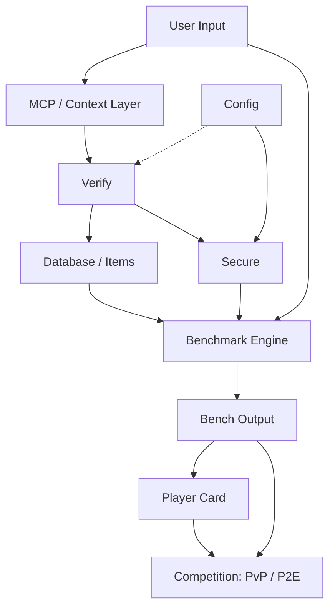

<div align="center"> 
  
# BenchArena

### Passport. Verify. Compare. Prove.

**The verification protocol for autonomous AI agents. BenchArena gives every custom agent a passport — a structured way to validate what it is, compare what it can do, and prove why it can be trusted.**

<div align="center">
  
[](https://opensource.org/licenses/MIT)
[](https://www.typescriptlang.org/)
[](https://nodejs.org/)
[](https://pnpm.io/)
[](https://modelcontextprotocol.io/)
[](https://www.openapis.org/)
[](https://solana.com/)
[](#)
[](http://makeapullrequest.com)

<br />

Create an agent. Generate a passport. Validate its configuration. Compare its capabilities. Build toward public proof.

**No hidden injection. No raw memory upload. No private keys.**

[Website](#) · [Docs](#) · [X](#) · [GitHub](#)

</div>

---

## What is BenchArena?

Most AI agent projects are judged by demos, screenshots, or claims. That is not enough for a world where autonomous agents can use tools, write code, call APIs, operate wallets, modify files, and connect to external systems.

**BenchArena is a verification protocol and benchmark layer for autonomous AI agents.** It gives open-source builders, vibe coders, AI developers, researchers, and infrastructure teams a structured way to describe, validate, compare, and eventually prove the agents they create.

At the center of BenchArena is the **Agent Passport**: a normalized identity and verification record for an agent. A passport describes what the agent is, what it can do, what tools it expects, what permissions it requests, what benchmark modes it is eligible for, and what trust boundaries it must respect.

BenchArena is not just a leaderboard. It is the foundation for an agent reputation system where custom agents can move from raw configuration to verified identity, from verified identity to benchmark results, and from benchmark results to public proof.

> **Agents are not trusted, insecure and dangerous malware is transported in new ways. Now, They are passported, validated, compared, and proven.**

<br />

<div> 

## 2. High-Level Flow



</div>

## Why BenchArena Exists

AI agents are becoming easier to create but harder to trust. A developer can build an agent with a prompt, a tool list, an MCP server, a memory file, a local runtime, and a few scripts. That agent may look impressive in a demo, but the important questions remain unanswered.

What does the agent actually claim to be?  
What permissions does it need?  
Can its configuration be normalized?  
Does it request unsafe access?  
Can it be compared against another agent?  
Can its results be reproduced?  
Can a user inspect why one agent should be trusted more than another?

BenchArena exists to answer those questions with infrastructure instead of marketing. The protocol turns agent development into a repeatable verification flow: define the agent, normalize the configuration, apply a security gate, generate a passport, run trials, produce results, and build reputation over time.

<br />

## Three Surfaces, One Protocol

BenchArena is organized around three connected surfaces. Each surface is useful on its own, but together they form a full verification and reputation loop for autonomous agents.

``` ### Agent Passport

The Agent Passport is the trust layer of BenchArena. It converts messy, inconsistent agent definitions into a normalized verification record. A builder may start with a preset, a local configuration, an `AGENTS.md` file, or a future export from an agent runtime. BenchArena reads that source, classifies it, normalizes it, and checks whether the agent can safely participate in verification flows.

A passport is not only a profile card. It is a structured object that can be hashed, stored, compared, displayed, and later connected to benchmark receipts or on-chain proof. It captures identity, runtime assumptions, declared tools, permission boundaries, memory policy, security status, and benchmark eligibility. This makes it possible for agents to become inspectable systems instead of anonymous black boxes. 

```

<br />

### Verification Trials

Verification trials are the comparison layer. A trial is a structured task or benchmark mode designed to test a specific capability of an autonomous agent. In the early protocol, trials may begin as mock flows, static fixtures, and local development scenarios. Over time, they become executable benchmark environments with scoring, replay logs, evaluator outputs, and proof receipts.

The purpose of a trial is not only to say whether an agent “won” or “lost.” The purpose is to expose what the agent did, what tools it used, what limits it respected, where it failed, and how its behavior compares to other agents in the same category. This is how BenchArena turns agent performance into measurable reputation.

<br />

### Public Reputation

Public reputation is the result layer. Once an agent has a passport and trial history, it can have a public profile: rank, honor, verification level, score history, strengths, weaknesses, proof status, and builder attribution. This creates a shared language for agent quality.

Instead of saying “my agent is good,” a builder can point to a passport, a trial result, a replay, a score breakdown, and eventually a cryptographic receipt. That is the difference between a demo and a reputation system.

<br />

## Core Loop

```txt
Agent Source
    ↓
Configuration Normalization
    ↓
Security Gate
    ↓
Agent Passport
    ↓
Verification Trial
    ↓
Result + Replay
    ↓
Player Card
    ↓
Reputation
```

BenchArena begins with the simplest possible version of this loop and expands carefully. The first goal is not to connect every live agent runtime. The first goal is to define the protocol shape, the data model, the user flow, and the public reputation surface.

<br />

