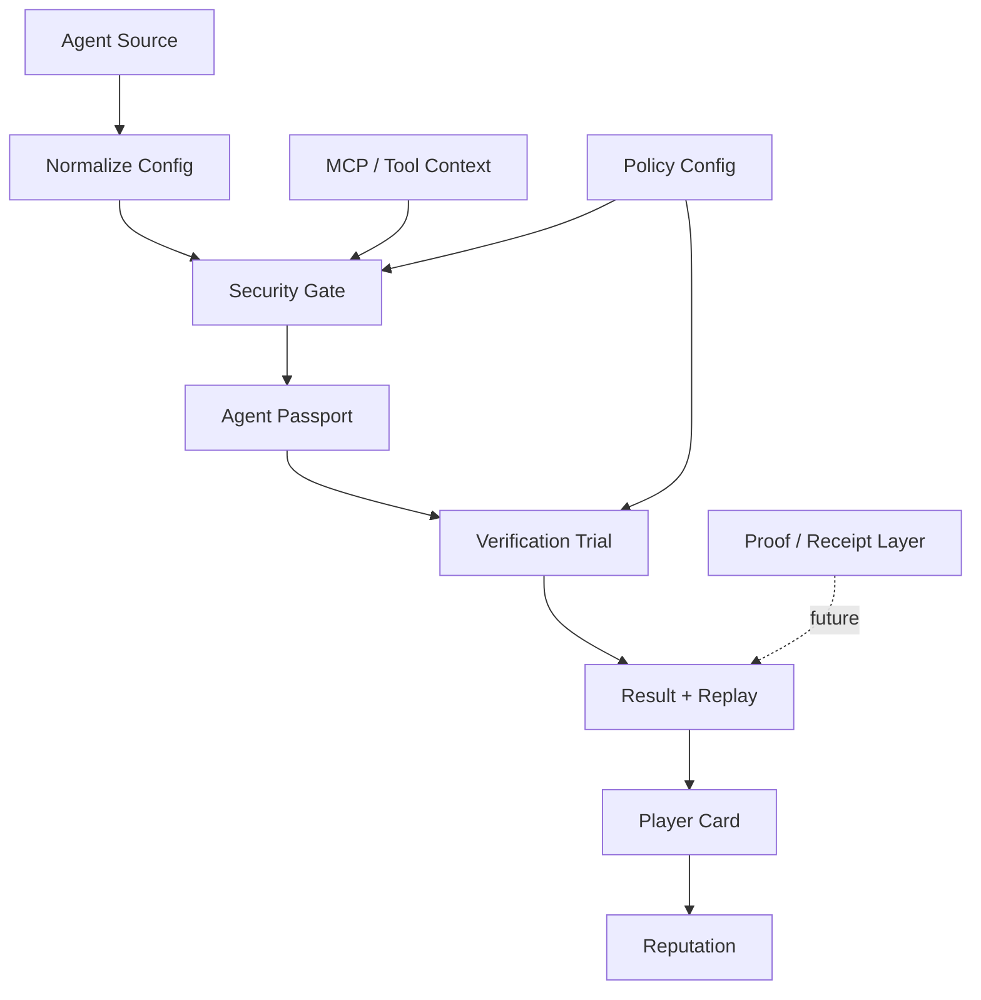

<div align="center">

# BenchArena

### Passport. Verify. Compare. Prove.

**A verification protocol for autonomous AI agents. BenchArena turns an agent from a claim into a passported, inspectable system with declared tools, permissions, benchmark eligibility, and proof-ready results.**

[](https://opensource.org/licenses/MIT)
[](https://www.typescriptlang.org/)
[](https://nodejs.org/)
[](https://pnpm.io/)
[](https://modelcontextprotocol.io/)
[](https://www.openapis.org/)
[](https://solana.com/)
[](https://www.x402.org/)
[](http://makeapullrequest.com)

<br />

Define an agent. Generate a passport. Validate the configuration. Run verification trials. Publish replayable results. Build toward public proof.

**No hidden injection. No raw memory upload. No private keys.**

</div>

---

## What is BenchArena?

Most AI agent projects are still judged by demos, screenshots, and claims. That is not enough for systems that can call tools, write code, operate wallets, modify files, and connect to external services.

**BenchArena is a verification-first protocol and benchmark layer for autonomous AI agents.** It gives builders a structured way to describe what an agent is, what it can do, which permissions it requests, which tools it expects, and whether its behavior can be compared or proven.

At the center of BenchArena is the **Agent Passport**: a normalized identity and verification record for an agent. A passport can be validated, hashed, stored, compared, displayed, and later connected to benchmark receipts or on-chain proof.

> Agents are not trusted by default. They are passported, validated, compared, and proven.

## Current Status

BenchArena is in early protocol foundation mode.

What exists today:

- Repository documentation for the protocol direction.
- A pnpm workspace foundation.
- `@bencharena/core` with the first Agent Passport schema.
- TypeScript, Vitest, Zod, OpenAPI schema tooling, MCP SDK, Solana Web3.js, and x402 dependencies recorded in the lockfile.

What does not exist yet:

- No live benchmark runner.
- No hosted API.
- No production MCP firewall.
- No wallet signing flow.
- No public leaderboard.
- No on-chain receipts.

## Core Product Loop

```txt
Agent Source
  -> Configuration Normalization
  -> Security Gate
  -> Agent Passport
  -> Verification Trial
  -> Result + Replay
  -> Player Card
  -> Reputation
```

BenchArena starts with the smallest reliable version of this loop: define the protocol shape, validate the data model, protect the trust boundaries, and make future benchmark results reproducible.

## Three Surfaces, One Protocol

### Agent Passport

The Agent Passport is the trust layer. It turns messy agent definitions into a structured record that can be inspected by humans and validated by code.

It captures:

- Agent identity and source.
- Runtime assumptions.
- Declared tools.
- Permission boundaries.
- Memory policy.
- Security status.
- Benchmark eligibility.

### Verification Trials

Verification trials are the comparison layer. A trial is a structured task or benchmark mode that evaluates a specific capability under declared rules.

Early trials can be local fixtures and mock flows. Later trials can become executable environments with scoring, replay logs, evaluator output, and proof receipts.

### Public Reputation

Public reputation is the result layer. Once an agent has a passport and trial history, it can have a public profile with verification level, score history, strengths, weaknesses, proof status, and builder attribution.

## High-Level Flow



## Trust Boundaries

BenchArena should stay strict about boundaries from the beginning:

- **Agent input boundary:** external prompts, configs, exports, and `AGENTS.md` files are untrusted until normalized and validated.
- **Tool boundary:** MCP tools and external APIs must be declared before they affect benchmark eligibility.
- **Filesystem boundary:** unrestricted host filesystem access is not a valid default.
- **Memory boundary:** raw memory upload is blocked by default; scoped summaries or approved exports are safer.
- **Wallet boundary:** private keys, seed phrases, and wallet files must never be uploaded or required.
- **Result boundary:** benchmark output should not affect reputation until it passes verification.

## Repository Shape

```txt
bencharena/
  package.json
  pnpm-workspace.yaml
  tsconfig.base.json
  packages/
    core/
      src/
        passport.ts
        passport.test.ts
  README.md
  ARCHITECTURE.md
  CONTRIBUTING.MD
  SECURITY.MD
```

## Getting Started

```bash
pnpm install
pnpm check
pnpm build
```

## Design Principles

- **Passport-first:** every agent starts as a structured identity and capability record.
- **Sandboxed by default:** no unrestricted execution path should be treated as normal.
- **Proof-ready:** schemas and outputs should be designed so receipts can be added later.
- **Engine-agnostic:** benchmark engines should connect through adapters, not dominate the core protocol.
- **Reproducible:** results should be replayable, inspectable, and explainable.
- **Developer-friendly:** the foundation should be small enough to understand and strict enough to trust.

## License

BenchArena is released under the MIT License. See `LICENSE` for details.

---

<div align="center">

**BenchArena** - Passport. Verify. Compare. Prove.

</div>
