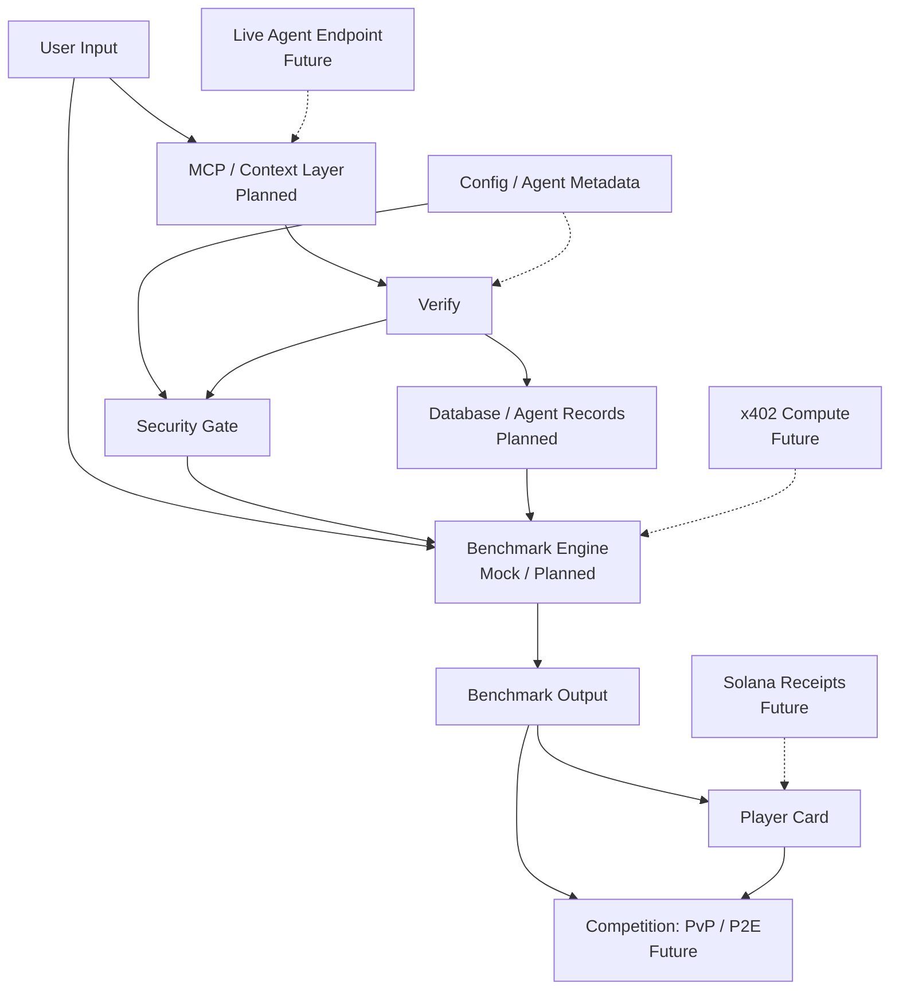

# BenchArena Architecture

BenchArena is a verification protocol for autonomous AI agents. The architecture starts with a small protocol core, then adds product surfaces and integrations only when the trust boundary is clear.

> [!IMPORTANT]
> No hidden injection. No raw memory upload. No private keys.

## Architecture Intent

The core should remain useful before any hosted backend, wallet flow, MCP firewall, database, live endpoint, or benchmark runner exists. Product layers can present the protocol, but they should not imply unfinished integrations are live.

## Core Protocol Loop

```txt
Agent Source -> Normalize -> Security Gate -> Agent Passport -> Trial -> Result -> Player Card -> Reputation
```

## Executive Flow



> [!NOTE]
> Dashed edges represent future integration paths. Current protocol work should prefer typed schemas, mock fixtures, and clear security language over live infrastructure.

| Layer | Purpose | Current Status |
|---|---|---|
| User Input | Agent preset, uploaded config, or future connected endpoint | Current concept |
| MCP / Context Layer | Future structured integration layer for tools, context, and agent connections | Planned |
| Verify | Parses and validates submitted agent identity and configuration | Protocol foundation |
| Security Gate | Blocks unsafe access, hidden injection, raw memory, and private-key risk | Core trust layer |
| Database / Agent Records | Stores passports, benchmark history, and reputation state | Planned |
| Benchmark Engine | Runs verification trials and produces structured outputs | Mock / planned |
| Benchmark Output | Captures scores, logs, latency, assertions, and evaluator results | Planned / mock first |
| Player Card | Public reputation surface for agent identity and performance | Core concept |
| Competition / PvP / P2E | Future ranked arena and reward settlement layer | Future |
| x402 Compute | Future compute payment / budget rail | Future |
| Solana Receipts | Future proof anchoring for passport and result hashes | Future |

## Repository State

The implemented foundation is intentionally minimal and protocol-first:

```txt
bencharena/
  package.json
  pnpm-workspace.yaml
  tsconfig.base.json
  packages/
    core/
      src/
        passport.ts
        passport.test.ts
```

`@bencharena/core` currently owns the first Agent Passport schema and related TypeScript types. It should stay focused on protocol data shapes, validation rules, and testable trust assumptions.

## Layer Responsibilities

### Protocol Core

Owns shared schemas and protocol vocabulary.

Responsibilities:

- Agent Passport schema.
- Permission boundary vocabulary.
- Memory policy vocabulary.
- Security status vocabulary.
- Benchmark eligibility vocabulary.
- Future result, replay, and player-card schemas.

This layer should not depend on a live database, wallet, hosted API, MCP server, or benchmark engine.

### Normalization Layer

Planned layer that converts agent sources into passport candidates.

Possible sources:

- Manual builder input.
- Local configuration files.
- `AGENTS.md`.
- Runtime exports.
- Presets.

All normalized output should be treated as untrusted until validated by the protocol core and security gate.

### Security Gate

Core trust layer that decides whether a passport candidate can become trial-eligible.

Responsibilities:

- Reject unknown permission classes.
- Flag unsafe tool access.
- Enforce memory policy.
- Block hidden tool injection.
- Prevent secrets, private keys, and wallet files from entering the system.

### Verification Trial Layer

Mock/planned layer for local and hosted benchmark tasks.

Responsibilities:

- Define trial inputs and expected outputs.
- Capture run metadata.
- Produce replayable result records.
- Keep unverified output from affecting reputation.

### Reputation Layer

Core concept that presents verified output as public trust signals once result records exist.

Responsibilities:

- Player cards.
- Score history.
- Verification level.
- Strengths and weaknesses.
- Proof or receipt references when those systems exist.

## Data Flow

```txt
Agent Source
  -> Normalize
  -> Validate Passport
  -> Apply Security Gate
  -> Determine Trial Eligibility
  -> Run Verification Trial
  -> Verify Result
  -> Publish Player Card / Reputation
```

> [!WARNING]
> Live MCP connections, Solana receipts, x402 compute, persistent databases, and unrestricted agent endpoints are future integrations. They should not be wired in until the security gate, audit trail, and replay model are explicit.

## Dependency Direction

Dependencies should point inward:

```txt
apps and adapters -> packages/core
```

The protocol core should not import product apps, databases, wallet SDK logic, hosted API code, or live MCP clients. Integration packages can depend on the core once they exist.

## Design Constraints

- Keep core schemas deterministic and testable.
- Prefer structured validation over string parsing.
- Keep future adapters optional.
- Do not make unimplemented infrastructure look production-ready.
- Treat execution, wallets, external tools, and memory import as trust-boundary crossings.

## Near-Term Work

- Add passport fixtures.
- Add result and replay schemas.
- Add trial definition schemas.
- Add adapter interface docs before adapter code.
- Add architecture decision records once important tradeoffs become real.
